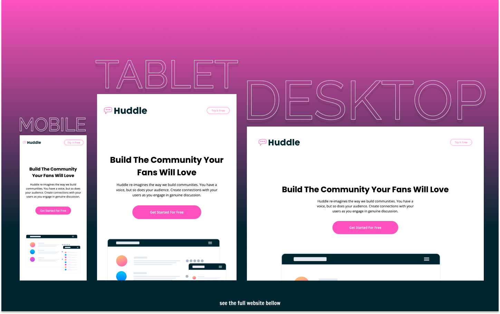

# Frontend Mentor - Huddle Landing Page with Curves Solution

This is a solution to the [Huddle Landing Page with Curves Challenge on Frontend Mentor](https://www.frontendmentor.io/challenges/huddle-landing-page-with-curved-sections-5ca5ecd01e82137ec91a50f2).

## Table of contents

- [Overview](#overview)
  - [The challenge](#the-challenge)
  - [Screenshot](#screenshot)
  - [Links](#links)
- [My process](#my-process)
  - [Built with](#built-with)
  - [What I learned](#what-i-learned)
  - [Useful resources](#useful-resources)
- [Author](#author)

## Overview

### The challenge

Users should be able to:

- View the optimal layout for the site depending on their device's screen size
- See hover states for all interactive elements on the page
- Show an error message if the user types an invalid email

### Screenshot

### Links

- Live Site URL: [https://kens-visuals.github.io/huddle-landing-page-with-curves/](https://kens-visuals.github.io/huddle-landing-page-with-curves/)
- Solution URL: [TO_BE_UPDATED](TO_BE_UPDATED)

## My process

### Built with

- Semantic HTML5 markup
- SCSS custom properties
- CSS Flexbox
- CSS Grid
- Vanilla JS
- Mobile-first workflow

### What I learned

That's it, this is the last challenge in **JUNIOR** level, and I managed to finish the whole section within a month. Which also means that I've reached my goal of finishing all projects in **JUNIOR** level before the end of the year. I'm really excited about this and what's coming next, in terms of projects and all the cool stuff I'm going to learn and practice. For the next level, I'm planning to learn React and start the upcoming projects with `React`, because I feel quite confident in `Vanilla JS` and `DOM manipulations`. So, I don't want to miss the chance of practicing `React` with all those awesome projects in **INTERMEDIATE** level.

## Author

- Frontend Mentor - [@kens-visuals](https://www.frontendmentor.io/profile/kens-visuals)
- Codewars - [@kens_visuals](https://www.codewars.com/users/kens_visuals)
- CodePen - [@kens-visuals](https://codepen.io/kens-visuals)
